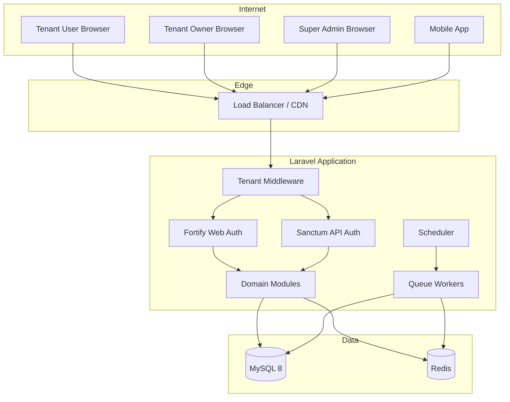
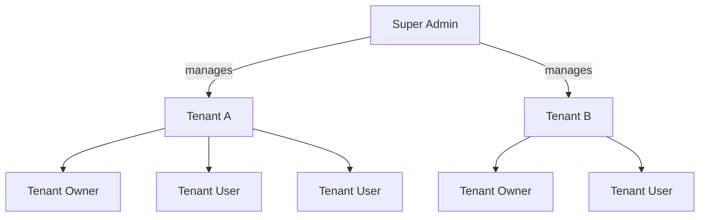
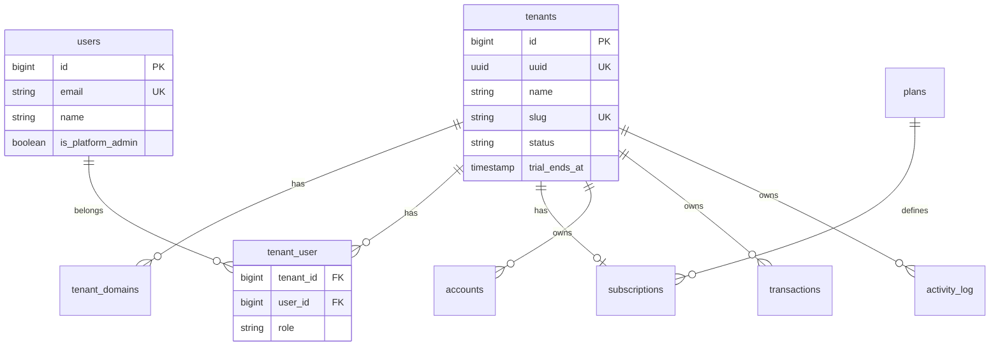
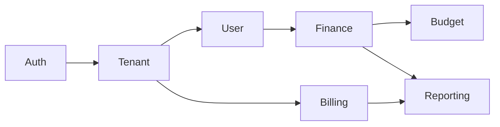

# Step 1 — Web Foundation Architecture

**Finance Assistant** · Multi-Tenant SaaS Personal Finance Platform

| Field | Value |
|-------|-------|
| Version | 1.0.0 |
| Status | Architecture (design only) |
| Stack | Laravel 13 · PHP 8.4+ · MySQL 8 · Redis · Sanctum · Vuexy · Tailwind |

---

## Table of Contents

1. [Folder Architecture](#1-folder-architecture)
2. [SaaS Architecture](#2-saas-architecture)
3. [Role & Permission Strategy](#3-role--permission-strategy)
4. [Database Architecture](#4-database-architecture)
5. [Coding Standards](#5-coding-standards)
6. [Feature Module Structure](#6-feature-module-structure)
7. [Route Structure](#7-route-structure)
8. [Service Layer Structure](#8-service-layer-structure)
9. [Repository Pattern Structure](#9-repository-pattern-structure)
10. [Activity Log Strategy](#10-activity-log-strategy)

---

## 1. Folder Architecture

### 1.1 Design Principles

- **Domain-first**: Business logic grouped by bounded context, not technical layer alone.
- **Thin edges**: Controllers and jobs delegate to services; no business rules in HTTP layer.
- **Explicit tenancy**: Every tenant-scoped path passes through tenant resolution middleware.
- **Test mirror**: Test structure mirrors `app/Modules/` for discoverability.

### 1.2 Target Directory Tree

```
finance-assistant/
├── app/
│   ├── Console/
│   │   └── Commands/                    # Thin Artisan commands → dispatch jobs/services
│   ├── Enums/                           # Cross-cutting enums (Status, Currency, etc.)
│   ├── Exceptions/                      # Domain exceptions + HTTP render mapping
│   ├── Http/
│   │   ├── Controllers/
│   │   │   ├── Admin/                   # Super Admin (platform) controllers
│   │   │   ├── Api/V1/                  # Versioned public API
│   │   │   ├── Tenant/                  # Tenant Owner dashboard controllers
│   │   │   └── Web/                     # Vuexy SPA shell / legacy Blade bridges
│   │   ├── Middleware/
│   │   │   ├── IdentifyTenant.php
│   │   │   ├── EnsureTenantIsActive.php
│   │   │   ├── SetTenantContext.php
│   │   │   └── EnsurePlatformAdmin.php
│   │   ├── Requests/                    # Form requests (grouped by module)
│   │   └── Resources/                   # API resources (grouped by module)
│   ├── Jobs/                            # Queue jobs (module subfolders)
│   ├── Listeners/
│   ├── Models/
│   │   ├── Platform/                    # Non-tenant: Tenant, Plan, Subscription
│   │   └── Concerns/                    # BelongsToTenant, HasUuid, Auditable
│   ├── Modules/                         # ★ Primary domain home
│   │   ├── Auth/
│   │   ├── Tenant/
│   │   ├── User/
│   │   ├── Finance/
│   │   ├── Budget/
│   │   ├── Reporting/
│   │   └── Billing/
│   ├── Policies/
│   ├── Providers/
│   │   ├── AppServiceProvider.php
│   │   ├── AuthServiceProvider.php
│   │   ├── TenancyServiceProvider.php
│   │   └── ModuleServiceProvider.php    # Auto-registers module routes, bindings
│   ├── Repositories/                    # Contracts + Eloquent implementations
│   │   └── Contracts/
│   ├── Services/                        # Cross-cutting only (not domain logic)
│   │   ├── Tenancy/
│   │   └── Activity/
│   └── Support/                         # Helpers, traits, value objects
│       └── ValueObjects/
├── bootstrap/
├── config/
│   ├── tenancy.php                      # Tenant resolution, domains, plans
│   ├── permissions.php                  # Role → permission map
│   └── modules.php                      # Enabled modules, feature flags
├── database/
│   ├── migrations/
│   │   ├── platform/                    # tenants, plans, subscriptions
│   │   └── tenant/                      # tenant-scoped tables
│   ├── factories/
│   └── seeders/
│       ├── PlatformSeeder.php
│       └── DemoTenantSeeder.php
├── docs/
│   └── architecture/                    # This documentation
├── resources/
│   ├── js/                              # Vue 3 + Vuexy SPA
│   │   ├── app.ts
│   │   ├── layouts/                     # Vuexy layouts (vertical, horizontal)
│   │   ├── pages/
│   │   │   ├── admin/                   # Super Admin pages
│   │   │   ├── tenant/                  # Tenant Owner pages
│   │   │   └── app/                     # Tenant User pages
│   │   ├── components/
│   │   ├── composables/
│   │   ├── stores/                      # Pinia
│   │   ├── plugins/                     # Sanctum, axios/fetch, permissions
│   │   └── router/
│   ├── css/
│   └── views/
│       └── app.blade.php                # SPA mount point
├── routes/
│   ├── admin.php                        # Super Admin routes
│   ├── api.php                          # API v1
│   ├── tenant.php                       # Tenant Owner routes
│   ├── web.php                          # SPA fallback + public
│   └── console.php                      # Scheduler definitions
├── tests/
│   ├── Architecture/                    # Pest arch() rules
│   ├── Feature/
│   │   ├── Admin/
│   │   ├── Api/
│   │   ├── Tenant/
│   │   └── Modules/
│   └── Unit/
│       └── Modules/
└── docker/                              # Optional: MySQL 8 + Redis compose
```

### 1.3 Module Internal Structure

Each module under `app/Modules/{ModuleName}/` follows the same skeleton:

```
app/Modules/Finance/
├── Actions/                 # Single-purpose command objects
├── Data/                    # DTOs, Data objects (spatie/laravel-data optional)
├── Enums/
├── Events/
├── Exceptions/
├── Http/
│   ├── Controllers/
│   └── Requests/
├── Jobs/
├── Listeners/
├── Models/
├── Observers/
├── Policies/
├── Repositories/
│   ├── Contracts/
│   └── Eloquent/
├── Resources/
├── Routes/
│   ├── api.php
│   └── web.php
├── Services/
└── FinanceServiceProvider.php
```

### 1.4 Namespace Convention

| Path | Namespace |
|------|-----------|
| `app/Modules/Finance/Models/Account.php` | `App\Modules\Finance\Models\Account` |
| `app/Modules/Finance/Services/AccountService.php` | `App\Modules\Finance\Services\AccountService` |
| `app/Repositories/Contracts/TenantRepository.php` | `App\Repositories\Contracts\TenantRepository` |
| `app/Http/Controllers/Admin/TenantController.php` | `App\Http\Controllers\Admin\TenantController` |

---

## 2. SaaS Architecture

### 2.1 Tenancy Model

**Strategy: Single database, shared schema, row-level isolation via `tenant_id`.**

| Decision | Rationale |
|----------|-----------|
| Single MySQL 8 database | Lower ops cost; simpler backups; fits personal finance scale |
| `tenant_id` on all tenant tables | Explicit scoping; works with Eloquent global scopes |
| Subdomain + custom domain support | `acme.financeassistant.com` or `finance.acme.com` |
| Platform tables without `tenant_id` | `tenants`, `plans`, `subscriptions`, `platform_users` |



### 2.2 Tenant Lifecycle

| State | Description | Access |
|-------|-------------|--------|
| `pending` | Registered, not verified | Owner onboarding only |
| `trial` | Trial period active | Full features, time-limited |
| `active` | Paid or free active | Full access per plan |
| `suspended` | Billing failure / admin action | Read-only or blocked |
| `cancelled` | Churned | Export window, then archived |

### 2.3 Tenant Resolution Order

1. **Custom domain** — `Host` header → `tenant_domains.domain`
2. **Subdomain** — `{slug}.financeassistant.com` → `tenants.slug`
3. **API header** — `X-Tenant-Id` or `X-Tenant-Slug` (Sanctum mobile)
4. **Session** — `tenant_id` stored after owner/user selects workspace

### 2.4 Request Context Object

```php
// app/Support/Tenancy/TenantContext.php (design reference — not implemented)
final class TenantContext
{
    public function __construct(
        public readonly ?Tenant $tenant,
        public readonly ?User $user,
        public readonly TenantScope $scope, // platform | tenant | guest
    ) {}
}
```

Injected per-request via `SetTenantContext` middleware and available through `app(TenantContext::class)`.

### 2.5 Application Layers

| Layer | Responsibility | May Call |
|-------|----------------|----------|
| Controller | HTTP I/O, authorize, delegate | Service, Form Request |
| Service | Business rules, orchestration | Repository, Events, Jobs |
| Repository | Persistence queries | Eloquent (only here for reads/writes) |
| Action | Single atomic operation | Repository, Service |
| Job | Async / retryable work | Service |
| Observer | Model side-effects | Activity log, Events |

### 2.6 Infrastructure (Production)

| Component | Technology | Purpose |
|-----------|------------|---------|
| App server | Laravel Herd / Forge / Octane | HTTP |
| Database | MySQL 8 (InnoDB, utf8mb4) | Primary store |
| Cache | Redis DB 1 | Config, permissions, rate limits |
| Session | Redis DB 2 | Web sessions |
| Queue | Redis DB 3 + Horizon | Async jobs |
| Scheduler | Cron → `schedule:run` | Recurring tasks |
| Files | S3-compatible | Receipts, exports |

### 2.7 Environment Variables (Production Target)

```dotenv
DB_CONNECTION=mysql
DB_HOST=127.0.0.1
DB_PORT=3306
DB_DATABASE=finance_assistant
DB_USERNAME=
DB_PASSWORD=

CACHE_STORE=redis
SESSION_DRIVER=redis
QUEUE_CONNECTION=redis

REDIS_CLIENT=phpredis
REDIS_HOST=127.0.0.1
REDIS_PORT=6379

SANCTUM_STATEFUL_DOMAINS=financeassistant.com,*.financeassistant.com
```

---

## 3. Role & Permission Strategy

### 3.1 Role Hierarchy



| Role | Scope | Description |
|------|-------|-------------|
| **Super Admin** | Platform (`tenant_id = null`) | Manages tenants, plans, platform settings, impersonation |
| **Tenant Owner** | Single tenant | Billing, invites users, tenant settings, full data access |
| **Tenant User** | Single tenant | Personal finance features; limited admin |

### 3.2 Recommended Package

**[spatie/laravel-permission](https://github.com/spatie/laravel-permission)** with teams feature mapped to `tenant_id`.

| Concept | Mapping |
|---------|---------|
| Role | `super-admin`, `tenant-owner`, `tenant-user` |
| Team | `tenant_id` (Spatie teams / custom pivot) |
| Permission | Granular: `accounts.view`, `transactions.create`, `budgets.manage`, etc. |

### 3.3 Permission Naming Convention

```
{resource}.{action}[.{scope}]
```

| Pattern | Example |
|---------|---------|
| View | `accounts.view` |
| Create | `transactions.create` |
| Manage (all) | `users.manage` |
| Own only | `transactions.delete.own` |
| Platform | `tenants.manage` (Super Admin only) |

### 3.4 Default Permission Matrix

| Permission | Super Admin | Tenant Owner | Tenant User |
|------------|:-----------:|:------------:|:-----------:|
| `tenants.manage` | ✓ | — | — |
| `tenants.view` | ✓ | — | — |
| `billing.manage` | ✓ | ✓ | — |
| `users.manage` | ✓ | ✓ | — |
| `users.invite` | — | ✓ | — |
| `settings.tenant` | ✓ | ✓ | — |
| `accounts.view` | ✓ | ✓ | ✓ |
| `accounts.manage` | — | ✓ | ✓ (own) |
| `transactions.view` | ✓ | ✓ | ✓ |
| `transactions.create` | — | ✓ | ✓ |
| `transactions.delete` | — | ✓ | own |
| `budgets.manage` | — | ✓ | ✓ |
| `reports.view` | ✓ | ✓ | ✓ |
| `reports.export` | — | ✓ | ✓ |
| `activity.view` | ✓ | ✓ | — |

### 3.5 Authorization Enforcement

| Layer | Mechanism |
|-------|-----------|
| Routes | Middleware `role:`, `permission:`, `EnsurePlatformAdmin` |
| Controllers | `$this->authorize()` via Policies |
| Services | Explicit guard clauses for cross-tenant safety |
| Repositories | **Mandatory** `tenant_id` scope on all tenant queries |
| API Resources | Hide fields based on role (never rely on this alone) |

### 3.6 Policy Structure

```
app/Policies/
├── Platform/
│   └── TenantPolicy.php          # Super Admin
└── Modules/
    ├── Finance/
    │   ├── AccountPolicy.php
    │   └── TransactionPolicy.php
    └── User/
        └── MemberPolicy.php
```

### 3.7 Super Admin Isolation

- Super Admin users live in `platform_users` **or** `users` with `is_platform_admin = true` and `tenant_id IS NULL`.
- Super Admin routes use `routes/admin.php` with prefix `/admin` and separate Vuexy layout.
- **Never** mix platform admin session with tenant context without explicit impersonation audit.

---

## 4. Database Architecture

### 4.1 Schema Groups



### 4.2 Platform Tables (no `tenant_id`)

| Table | Purpose |
|-------|---------|
| `tenants` | Tenant registry |
| `tenant_domains` | Subdomain / custom domain mapping |
| `plans` | SaaS pricing plans |
| `subscriptions` | Stripe/payment provider linkage |
| `platform_settings` | Key-value platform config |

### 4.3 Identity & Access Tables

| Table | Purpose |
|-------|---------|
| `users` | Global user identity (email unique globally) |
| `tenant_user` | Pivot: user ↔ tenant + role |
| `user_profiles` | Extended profile (existing) |
| `roles` / `permissions` | Spatie permission tables |
| `personal_access_tokens` | Sanctum tokens |
| `user_devices` | Device management (existing) |
| `login_histories` | Auth audit (existing) |
| `sessions` | Web sessions |

### 4.4 Tenant-Scoped Tables (all include `tenant_id`)

| Table | Purpose |
|-------|---------|
| `accounts` | Bank/cash/credit accounts |
| `categories` | Transaction categories |
| `transactions` | Income/expense entries |
| `budgets` | Budget periods |
| `budget_lines` | Category allocations |
| `goals` | Savings goals |
| `recurring_rules` | Scheduled transactions |
| `attachments` | Receipt files metadata |
| `tags` | Transaction tags |
| `activity_log` | Tenant audit trail |

### 4.5 Required Columns on Tenant Tables

```sql
-- Every tenant-scoped table MUST have:
tenant_id       BIGINT UNSIGNED NOT NULL,
created_by      BIGINT UNSIGNED NULL,      -- user_id
updated_by      BIGINT UNSIGNED NULL,
created_at      TIMESTAMP,
updated_at      TIMESTAMP,
deleted_at      TIMESTAMP NULL,            -- soft deletes where applicable

-- Indexes (minimum):
INDEX idx_{table}_tenant_id (tenant_id),
INDEX idx_{table}_tenant_created (tenant_id, created_at),
FOREIGN KEY (tenant_id) REFERENCES tenants(id) ON DELETE CASCADE
```

### 4.6 Multi-Tenant Query Rules

1. **Global scope** `TenantScope` applied to all tenant models.
2. **Bypass** only in Super Admin repositories with explicit `withoutGlobalScope()`.
3. **Composite unique keys** include `tenant_id`: e.g. `UNIQUE(tenant_id, slug)`.
4. **No cross-tenant joins** in tenant-facing code paths.
5. **Foreign keys** within tenant data reference same `tenant_id` (enforced in service layer).

### 4.7 Migration Organization

```
database/migrations/
├── 0001_01_01_000000_create_users_table.php
├── platform/
│   ├── 2026_01_01_000001_create_tenants_table.php
│   ├── 2026_01_01_000002_create_tenant_domains_table.php
│   ├── 2026_01_01_000003_create_plans_table.php
│   └── 2026_01_01_000004_create_subscriptions_table.php
└── tenant/
    ├── 2026_01_02_000001_create_accounts_table.php
    ├── 2026_01_02_000002_create_categories_table.php
    └── 2026_01_02_000003_create_transactions_table.php
```

---

## 5. Coding Standards

### 5.1 PHP Standards

| Rule | Standard |
|------|----------|
| Style | PSR-12, enforced by Laravel Pint |
| Static analysis | Larastan level 6+ |
| Type hints | Required on all methods, properties where applicable |
| Strict types | `declare(strict_types=1)` on new files |
| Constructors | PHP 8 constructor property promotion |
| Enums | TitleCase keys: `TransactionType::Expense` |
| Comments | PHPDoc on public APIs; no obvious inline comments |

### 5.2 Naming Conventions

| Entity | Convention | Example |
|--------|------------|---------|
| Model | Singular PascalCase | `Transaction` |
| Table | Plural snake_case | `transactions` |
| Controller | PascalCase + Controller | `TransactionController` |
| Service | PascalCase + Service | `TransactionService` |
| Repository | PascalCase + Repository | `TransactionRepository` |
| Contract | Interface prefix or suffix | `TransactionRepositoryInterface` |
| Form Request | Action + Request | `StoreTransactionRequest` |
| Job | Verb + Job | `RecalculateBudgetJob` |
| Event | Past tense | `TransactionCreated` |
| Policy | Model + Policy | `TransactionPolicy` |
| Enum | Singular PascalCase | `AccountType` |

### 5.3 Architecture Rules

| # | Rule |
|---|------|
| 1 | Controllers ≤ 15 lines per action; delegate to services |
| 2 | No Eloquent in controllers (except route model binding) |
| 3 | No business logic in repositories (query only) |
| 4 | No HTTP concerns in services |
| 5 | All tenant writes pass through `TenantContext` |
| 6 | All mutations logged via Activity Log strategy |
| 7 | Idempotent jobs where possible |
| 8 | Form Requests for all input validation |
| 9 | API Resources for all JSON output |
| 10 | Feature tests for every endpoint; unit tests for services |

### 5.4 Frontend Standards (Vuexy + Vue 3)

| Rule | Standard |
|------|----------|
| State | Pinia stores per domain |
| API | Composables wrapping Sanctum-authenticated fetch |
| Layout | Vuexy vertical layout for app; horizontal for marketing |
| Permissions | `v-can` directive from permission composable |
| Styling | Tailwind utilities; Vuexy SCSS variables via config |
| Types | TypeScript strict mode |

### 5.5 Git & PR Standards

| Item | Convention |
|------|------------|
| Branches | `feature/`, `fix/`, `chore/` prefixes |
| Commits | Conventional: `feat(finance): add transaction import` |
| PR size | ≤ 400 lines changed (split otherwise) |
| Required checks | Pint, PHPStan, Pest, ESLint |

---

## 6. Feature Module Structure

### 6.1 Module Catalog

| Module | Responsibility | Roles |
|--------|----------------|-------|
| **Auth** | Login, register, 2FA, devices, sessions | All |
| **Tenant** | Onboarding, settings, domains, switching | Owner, Super Admin |
| **User** | Members, invites, profiles, roles | Owner, Super Admin |
| **Finance** | Accounts, transactions, categories, tags | All tenant users |
| **Budget** | Budgets, alerts, rollovers | All tenant users |
| **Reporting** | Dashboards, exports, charts | All tenant users |
| **Billing** | Plans, subscriptions, invoices | Owner, Super Admin |

### 6.2 Module Dependency Graph



### 6.3 Module Registration

```php
// config/modules.php (design reference)
return [
    'enabled' => [
        'auth'      => App\Modules\Auth\AuthServiceProvider::class,
        'tenant'    => App\Modules\Tenant\TenantServiceProvider::class,
        'user'      => App\Modules\User\UserServiceProvider::class,
        'finance'   => App\Modules\Finance\FinanceServiceProvider::class,
        'budget'    => App\Modules\Budget\BudgetServiceProvider::class,
        'reporting' => App\Modules\Reporting\ReportingServiceProvider::class,
        'billing'   => App\Modules\Billing\BillingServiceProvider::class,
    ],
];
```

Each module's `ServiceProvider` registers:
- Route files (`Routes/api.php`, `Routes/web.php`)
- Repository bindings
- Event listeners
- Policies (via `Gate::policy()`)
- Scheduled tasks

### 6.4 Cross-Module Communication

| Allowed | Mechanism |
|---------|-----------|
| Module A → Module B read | Repository interface injection |
| Module A → Module B reaction | Domain Events + Listeners |
| **Forbidden** | Direct model access across modules |
| **Forbidden** | Circular service dependencies |

---

## 7. Route Structure

### 7.1 Route Files

| File | Prefix | Middleware | Audience |
|------|--------|------------|----------|
| `routes/web.php` | `/` | `web` | SPA shell, public pages |
| `routes/admin.php` | `/admin` | `web`, `auth`, `platform-admin` | Super Admin |
| `routes/tenant.php` | `/tenant` | `web`, `auth`, `tenant`, `verified` | Tenant Owner |
| `routes/api.php` | `/api/v1` | `api`, `auth:sanctum` | All API clients |
| Module routes | included | per module | Loaded by `ModuleServiceProvider` |

### 7.2 API Route Map (v1)

```
/api/v1/
├── auth/
│   ├── POST   register
│   ├── POST   login
│   ├── POST   logout
│   ├── POST   forgot-password
│   ├── POST   reset-password
│   └── GET    me
├── tenants/
│   ├── GET    /                    # list user's tenants
│   ├── POST   /                    # create tenant (onboarding)
│   ├── GET    {tenant}/
│   ├── PATCH  {tenant}/
│   └── POST   {tenant}/switch
├── users/
│   ├── GET    /
│   ├── POST   invite
│   └── DELETE {user}/
├── accounts/
│   ├── GET    /
│   ├── POST   /
│   ├── GET    {account}/
│   ├── PATCH  {account}/
│   └── DELETE {account}/
├── transactions/
│   ├── GET    /
│   ├── POST   /
│   ├── GET    {transaction}/
│   ├── PATCH  {transaction}/
│   └── DELETE {transaction}/
├── budgets/
│   └── ...
├── reports/
│   └── ...
└── activity/
    └── GET    /                    # audit log (owner+)
```

### 7.3 Super Admin Route Map

```
/admin/
├── dashboard
├── tenants/
│   ├── GET    /
│   ├── GET    {tenant}/
│   ├── PATCH  {tenant}/suspend
│   └── POST   {tenant}/impersonate
├── plans/
├── subscriptions/
├── users/
└── activity/
```

### 7.4 Middleware Stack

| Name | Alias | Purpose |
|------|-------|---------|
| `IdentifyTenant` | `tenant.identify` | Resolve tenant from domain/header |
| `EnsureTenantIsActive` | `tenant.active` | Block suspended tenants |
| `SetTenantContext` | `tenant` | Bind `TenantContext` to container |
| `EnsurePlatformAdmin` | `platform-admin` | Super Admin only |
| `EnsureTenantOwner` | `tenant-owner` | Owner-only routes |

### 7.5 Rate Limiting

| Limiter | Scope | Limit |
|---------|-------|-------|
| `api` | Per user + tenant | 120/min |
| `api-auth` | Per IP + email | 10/min |
| `admin` | Per admin user | 60/min |
| `export` | Per tenant | 5/hour |

---

## 8. Service Layer Structure

### 8.1 Service Categories

| Type | Location | Example |
|------|----------|---------|
| **Domain service** | `app/Modules/{Module}/Services/` | `TransactionService` |
| **Application service** | `app/Services/` | `Tenancy/TenantResolver` |
| **Integration service** | `app/Modules/{Module}/Services/Integrations/` | `StripeBillingService` |

### 8.2 Service Method Signature Pattern

```php
// Design reference
final class TransactionService
{
    public function __construct(
        private TransactionRepositoryInterface $transactions,
        private ActivityLogger $activity,
    ) {}

    public function create(CreateTransactionData $data, TenantContext $ctx): Transaction
    {
        // 1. Authorize (or assume controller did)
        // 2. Validate business rules
        // 3. Persist via repository
        // 4. Dispatch events
        // 5. Log activity
        // 6. Return model/DTO
    }
}
```

### 8.3 Service Responsibilities

| Does | Does Not |
|------|----------|
| Business rule enforcement | HTTP status codes |
| Orchestrate repositories | Raw SQL |
| Dispatch events/jobs | Blade/JSON formatting |
| Transaction boundaries (`DB::transaction`) | Tenant resolution |
| Call external APIs via integration services | Direct `Request` access |

### 8.4 Domain Service Catalog (Finance Module)

| Service | Methods (examples) |
|---------|---------------------|
| `AccountService` | `create`, `update`, `archive`, `recalculateBalance` |
| `TransactionService` | `create`, `update`, `delete`, `bulkImport`, `categorize` |
| `CategoryService` | `create`, `merge`, `seedDefaults` |
| `BudgetService` | `createPeriod`, `allocate`, `checkThresholds` |
| `ReportService` | `cashFlow`, `categoryBreakdown`, `exportCsv` |

### 8.5 Error Handling

| Exception | HTTP | When |
|-----------|------|------|
| `TenantNotFoundException` | 404 | Invalid tenant resolution |
| `TenantSuspendedException` | 403 | Suspended tenant access |
| `InsufficientPermissionException` | 403 | RBAC failure |
| `BusinessRuleException` | 422 | Validation of business rules |
| `ResourceNotFoundException` | 404 | Missing tenant-scoped resource |

---

## 9. Repository Pattern Structure

### 9.1 When to Use

| Use Repository | Skip Repository |
|----------------|-----------------|
| Complex queries | Simple `User::find()` in auth |
| Module persistence layer | Read-only config lookups |
| Testable data access | One-off seeders |
| Tenant-scoped query builders | |

### 9.2 Contract + Implementation Layout

```
app/Modules/Finance/Repositories/
├── Contracts/
│   ├── AccountRepositoryInterface.php
│   └── TransactionRepositoryInterface.php
└── Eloquent/
    ├── AccountRepository.php
    └── TransactionRepository.php
```

### 9.3 Interface Pattern

```php
// Design reference
interface TransactionRepositoryInterface
{
    public function findForTenant(int $id, int $tenantId): ?Transaction;

    /** @return LengthAwarePaginator<Transaction> */
    public function paginateForTenant(int $tenantId, TransactionFilter $filter): LengthAwarePaginator;

    public function create(array $attributes): Transaction;

    public function update(Transaction $transaction, array $attributes): Transaction;

    public function delete(Transaction $transaction): bool;

    public function sumByCategory(int $tenantId, Carbon $from, Carbon $to): Collection;
}
```

### 9.4 Repository Rules

| # | Rule |
|---|------|
| 1 | Every query includes `tenant_id` (or accepts `Tenant` model) |
| 2 | Return Eloquent models or Collections (not arrays) |
| 3 | No `Request` or `Auth` facades inside repositories |
| 4 | Filter/sort logic lives in repository or dedicated `*Filter` class |
| 5 | Bind interfaces in module `ServiceProvider` |
| 6 | Unit-test repositories against in-memory SQLite |

### 9.5 Binding Registration

```php
// App\Modules\Finance\FinanceServiceProvider (design reference)
public function register(): void
{
    $this->app->bind(
        TransactionRepositoryInterface::class,
        TransactionRepository::class,
    );
}
```

### 9.6 Query Filter Pattern

```
app/Modules/Finance/Filters/
└── TransactionFilter.php     # date range, category, account, search
```

Passed from Controller → Service → Repository.

---

## 10. Activity Log Strategy

### 10.1 Objectives

| Objective | Detail |
|-----------|--------|
| Audit trail | Who changed what, when, in which tenant |
| Compliance | Financial data change history |
| Security | Login, permission, impersonation events |
| Debugging | Trace failed operations |

### 10.2 Recommended Package

**[spatie/laravel-activitylog](https://github.com/spatie/laravel-activitylog)** with custom `tenant_id` column.

### 10.3 Log Categories

| Category | Event Examples | Retention |
|----------|----------------|-----------|
| **Auth** | Login, logout, 2FA, password change | 1 year |
| **Tenant** | Created, suspended, plan changed | Permanent |
| **Finance** | Transaction CRUD, account changes | 7 years |
| **Admin** | Impersonation, tenant suspension | Permanent |
| **System** | Job failures, imports | 90 days |

### 10.4 Schema Extension

```sql
-- Extend spatie activity_log table
ALTER TABLE activity_log ADD COLUMN tenant_id BIGINT UNSIGNED NULL AFTER id;
ALTER TABLE activity_log ADD INDEX idx_activity_tenant (tenant_id, created_at);
```

### 10.5 Logged Properties per Model

| Model | Logged Fields | Log Name |
|-------|---------------|----------|
| `Transaction` | all except timestamps | `finance` |
| `Account` | name, type, balance, status | `finance` |
| `User` (tenant member) | role changes only | `user` |
| `Tenant` | status, plan_id, name | `tenant` |

### 10.6 Implementation Pattern

```php
// Design reference — model trait
trait Auditable
{
    public function getActivitylogOptions(): LogOptions
    {
        return LogOptions::defaults()
            ->logOnlyDirty()
            ->dontSubmitEmptyLogs()
            ->useLogName($this->getTable())
            ->setDescriptionForEvent(fn (string $event) => "{$this->getTable()}.{$event}");
    }

    public function tapActivity(Activity $activity): void
    {
        $activity->tenant_id = app(TenantContext::class)->tenant?->id;
        $activity->properties = $activity->properties->merge([
            'ip' => request()->ip(),
            'user_agent' => request()->userAgent(),
        ]);
    }
}
```

### 10.7 Manual Activity Events

| Action | Logger call |
|--------|-------------|
| User invited | `activity('user')->causedBy($owner)->performedOn($tenant)->log('invited')` |
| Export downloaded | `activity('report')->log('exported cash flow')` |
| Impersonation start | `activity('admin')->log("impersonating tenant {$id}")` |
| Failed login | Existing `login_histories` table (keep separate) |

### 10.8 Access Control

| Role | Can View |
|------|----------|
| Super Admin | All logs (platform + any tenant) |
| Tenant Owner | Own tenant logs |
| Tenant User | Own actions only (optional) |

### 10.9 Performance

| Concern | Mitigation |
|---------|------------|
| Write volume | Queue activity writes (`ShouldQueue` on custom logger) |
| Table size | Partition by `created_at` monthly; archive to cold storage |
| Query speed | Index `(tenant_id, created_at, log_name)` |

---

## Appendix A — Scheduler & Queue Jobs

| Schedule | Job | Module |
|----------|-----|--------|
| Daily 00:00 | `RecalculateAccountBalancesJob` | Finance |
| Daily 06:00 | `CheckBudgetThresholdsJob` | Budget |
| Daily 02:00 | `ProcessRecurringTransactionsJob` | Finance |
| Hourly | `CheckTrialExpiryJob` | Billing |
| Weekly | `PruneActivityLogJob` | Platform |

Queue names: `default`, `finance`, `billing`, `notifications`, `reports`.

---

## Appendix B — Vuexy Integration Plan

| Phase | Action |
|-------|--------|
| 1 | Install Vue 3 + Vuexy template assets under `resources/js/` |
| 2 | Configure Vite for Vue (replace React plugin) |
| 3 | Build Sanctum auth composable + Pinia auth store |
| 4 | Map Vuexy menu to permission-driven navigation |
| 5 | Retire Inertia pages incrementally; API-first SPA |

---

## Appendix C — Alignment with Current Codebase

The existing starter kit provides a foundation to preserve:

| Existing | Reuse In Target |
|----------|-----------------|
| `app/Services/Auth/*` | `app/Modules/Auth/Services/` |
| `app/Models/User.php` + profiles/devices | `app/Modules/User/` |
| `routes/api.php` v1 auth | `app/Modules/Auth/Routes/api.php` |
| Fortify web auth | Keep for Vuexy SPA session mode |
| Sanctum tokens | Primary API auth for Vue SPA + mobile |
| Pest test structure | Extend under `tests/Feature/Modules/` |

---

## Appendix D — Next Steps (Step 2+)

1. Add `docs/architecture/STEP-02-TENANCY.md` — tenant middleware implementation spec
2. Scaffold `app/Modules/` with empty providers
3. Install Spatie Permission + Activity Log
4. Configure MySQL 8 + Redis in `.env.example`
5. Add Pest architecture tests enforcing layer boundaries

---

*Document owner: Engineering · Last updated: Step 1 Foundation*
