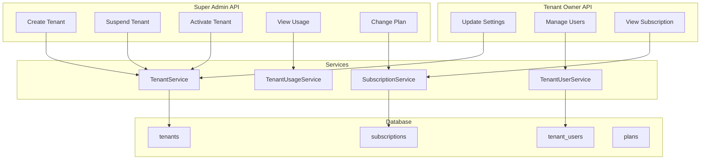

# Step 3 — SaaS Tenant Management

**Status:** Implemented  
**Payment gateway:** Not integrated (manual plan assignment only)

---

## Overview

Multi-tenant management layer for Finance Assistant. Super Admins manage tenants platform-wide; Tenant Owners manage settings and members within their workspace.



---

## Database Schema

### `plans`
| Column | Type | Notes |
|--------|------|-------|
| id | bigint PK | |
| name, slug | string | slug unique |
| price_monthly | decimal | Display only (no gateway) |
| max_users | int | Enforced on invite |
| features | json | Feature flags |
| is_active | boolean | |

### `tenants`
| Column | Type | Notes |
|--------|------|-------|
| id | bigint PK | |
| uuid | uuid unique | Public identifier |
| name, slug | string | slug unique |
| status | enum string | pending, trial, active, suspended, cancelled |
| settings | json | timezone, locale, currency |
| trial_ends_at | timestamp | |
| suspended_at | timestamp | |
| created_by | FK users | Super Admin who created |

### `subscriptions`
| Column | Type | Notes |
|--------|------|-------|
| id | bigint PK | |
| tenant_id | FK unique | One subscription per tenant |
| plan_id | FK plans | |
| status | enum | trialing, active, past_due, cancelled |
| quantity | int | Seat count |
| trial_ends_at, starts_at, ends_at | timestamps | |
| provider, provider_id | string nullable | Reserved for Stripe/etc. |

### `tenant_users`
| Column | Type | Notes |
|--------|------|-------|
| id | bigint PK | |
| tenant_id, user_id | FK | unique(tenant_id, user_id) |
| role | string | tenant-owner, tenant-user |
| invited_at, joined_at | timestamps | |

### `users` (extended)
| Column | Type |
|--------|------|
| is_platform_admin | boolean |

---

## API Routes

### Super Admin — `/api/v1/admin/tenants`

| Method | Endpoint | Action |
|--------|----------|--------|
| GET | `/` | List tenants (filter: status, search) |
| POST | `/` | Create tenant |
| GET | `/{tenant}` | Show tenant |
| POST | `/{tenant}/suspend` | Suspend tenant |
| POST | `/{tenant}/activate` | Activate tenant |
| GET | `/{tenant}/usage` | View usage metrics |
| PATCH | `/{tenant}/subscription` | Change plan |

**Middleware:** `auth:sanctum`, `verified`, `platform-admin`

### Tenant — `/api/v1/tenants`

| Method | Endpoint | Action | Middleware |
|--------|----------|--------|------------|
| GET | `/` | List user's tenants | auth |
| GET | `/{tenant}` | Show tenant | tenant.member |
| GET | `/{tenant}/subscription` | View subscription | tenant.member |
| GET/PATCH | `/{tenant}/settings` | Settings | tenant.owner |
| GET/POST | `/{tenant}/users` | List/invite users | tenant.owner |
| PATCH/DELETE | `/{tenant}/users/{user}` | Update/remove member | tenant.owner |

---

## Module Structure

```
app/Modules/Tenant/
├── Enums/           TenantStatus, TenantUserRole, SubscriptionStatus
├── Repositories/    TenantRepositoryInterface + Eloquent
├── Services/        TenantService, SubscriptionService, TenantUserService, TenantUsageService
├── Http/Requests/   Admin + tenant-scoped validation
├── Resources/       TenantResource, TenantUserResource, etc.
└── TenantServiceProvider.php

app/Models/Platform/   Tenant, Plan, Subscription, TenantUser
app/Http/Controllers/Admin/   TenantController
app/Http/Controllers/Api/Tenant/   Settings, Users, Subscription
app/Policies/Platform/   TenantPolicy
```

---

## Usage Metrics

`TenantUsageService` aggregates (no payment gateway required):

| Metric | Source |
|--------|--------|
| users_count | `tenant_users` |
| owners_count | `tenant_users` where role = owner |
| logins_last_30_days | `login_histories` for tenant members |
| last_activity_at | Latest successful login |
| plan_slug / max_users | `subscriptions` → `plans` |

---

## Seeding

```bash
php artisan db:seed --class=PlanSeeder
php artisan db:seed --class=RoleAndPermissionUserSeeder
```

| Seeder | Creates |
|--------|---------|
| PlanSeeder | free, pro, business plans |
| RoleAndPermissionUserSeeder | All role accounts (password: `password`) |

| Email | Role | Tenant |
|-------|------|--------|
| admin@financeassistant.com | Super Admin | — |
| owner@acme.com | Tenant Owner | Acme Corporation (active) |
| member@acme.com | Tenant User | Acme Corporation |
| owner@startup.com | Tenant Owner | Startup Inc (trial) |
| member@startup.com | Tenant User | Startup Inc |
| owner@suspended.com | Tenant Owner | Suspended LLC (suspended) |
| guest@example.com | Guest (no tenant) | — |

---

## Security

- Super Admin: `is_platform_admin` + `EnsurePlatformAdmin` middleware
- Tenant access: `EnsureTenantMember` + `TenantPolicy`
- Owner actions: `EnsureTenantOwner`
- Suspended tenants blocked for non-admin users
- Plan user limits enforced on invite

---

## Next Steps (Step 4+)

1. Spatie Permission integration (replace role string checks)
2. Tenant domain / subdomain resolution middleware
3. Activity log for tenant lifecycle events
4. Payment gateway (Stripe) webhook → subscription status
5. Vuexy Super Admin UI pages
